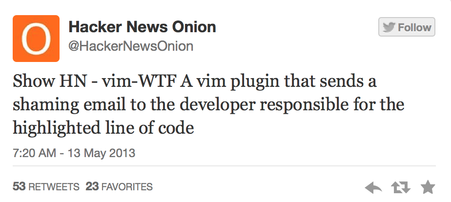

# SublimeScold

What is SublimeScold? It's this:

but for Sublime Text. Works with Git as version control.

## Steps to reproduce

1. Notice a piece of code that misses your expectations.
2. Select it, right-click and choose *Scold*.
3. Adjust the e-mail as you see fit.
4. Send it.
5. ???
6. Profit!

## Alternate scenarios

Both subject and e-mail body templates can be modified in plugin settings:

* see *Preferences > Package Settings > Scold > Settings - Default* for available options
* modify them in *Preferences > Package Settings > Scold > Settings - User*

## Will ~~not~~ maybe fix

* Support other version control systems
* Report errors betters
* Detect when you try to shame yourself (and you will, trust me)
